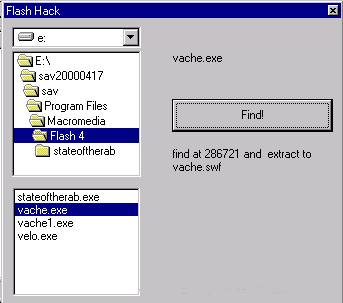



## swf \(flash\) extractor

### Description

before,sorry for my poor english...

Extract .swf files from flash4&5 autoplayer .exe files:

very usefull if you just want to send (by e-mail for example) the anim because the other person already have flashplayer or if you want to put the .swf on a web-page.The bug with the error 76 (see below in report)has been corrected in the new version .............PLEASE VOTE FOR ME.............
 
### More Info
 

             |
---                |---
**Submitted On**   |2000-12-13 17:33:20
**By**             |[COEYMAN Christophe](https://github.com/Planet-Source-Code/PSCIndex/blob/master/ByAuthor/coeyman-christophe.md)
**Level**          |Beginner
**User Rating**    |4.9 (44 globes from 9 users)
**Compatibility**  |VB 5\.0, VB 6\.0
**Category**       |[Complete Applications](https://github.com/Planet-Source-Code/PSCIndex/blob/master/ByCategory/complete-applications__1-27.md)
**World**          |[Visual Basic](https://github.com/Planet-Source-Code/PSCIndex/blob/master/ByWorld/visual-basic.md)
**Archive File**   |[CODE\_UPLOAD1264812132000\.zip](https://github.com/Planet-Source-Code/coeyman-christophe-swf-flash-extractor__1-13537/archive/master.zip)

